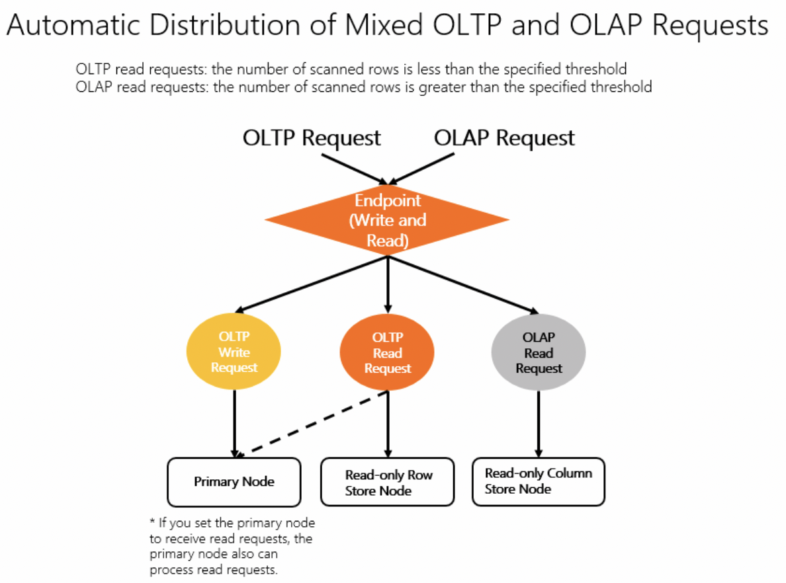
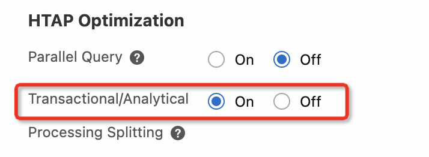
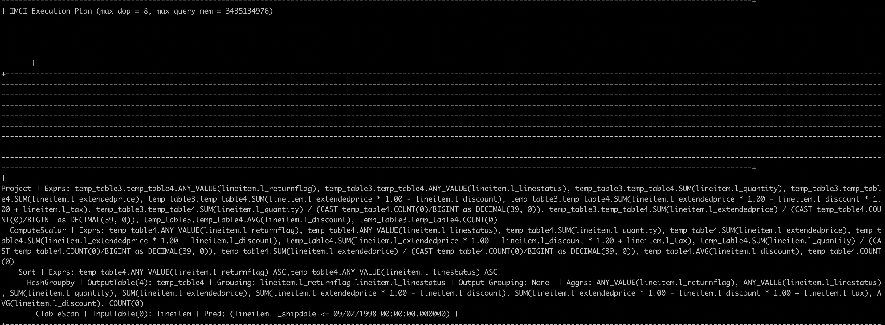
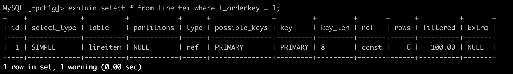

# Running TPC-H benchmark on PolarDB IMCI

---
### Overview

PolarDB MySQL supports the In-Memory Column Index (IMCI), which can increase the speed of complex analytical queries by several orders of magnitude while maintaining high performance in real-time transaction processing. IMCI's key features include hybrid row-column storage for real-time transactions and analysis, parallel SQL operators that support vectorized execution, and 100% MySQL syntax compatibility. As shown in the figure below, PolarDB eliminates the complex ETL process by creating read-only nodes with IMCI.
IMCI makes PolarDB become a cloud-native HTAP database. Users can easily get real-time data analysis and  transaction processing capabilities a single PolarDB cluster.  With the cluster endpoint, PolarDB will automatically dispatch OLAP and OLTP requests to different nodes.



### Before You Start

- Added a read-only columnar node in your PolarDB cluster. 
- Set `HTAP Optimization: Transactional/Analytical` ON.

- Created a database account: the account name is `'tpch'`, the password is  `'Tpch_password'`.


---

### Steps for Running TPC-H Queries

Follow the steps below to experience the HTAP solution with PolarDB IMCI:


##### Step 1. Generate and load TPC-H data

First, log in to your ECS server via the `ECS IP`,  and install the GIT and MySQL client.
```
$> sudo yum install -y mysql git
```

To easily generate and load TPC-H data, clone this Github project.

```
$> git clone  git@github.com:ApsaraDB/PolarDB-Hands-On.git
$> cp -rf PolarDB-Hands-On/PolarDB-M/IMCI/benchtpch ./
```

Then, compile the TPC-H data generation tool.

```
$> cd benchtpch/dbgen-src
$> echo "#define EOL_HANDLING 1" >> config.h 
$> make
```

Now, use the following command to generate 1GB TPC-H data (i.e., Scale Factor=1), and load it into PolarDB. Please fill in your PolarDB's cluster endpoint in the command. This step may take a few minutes, please wait and do not interrupt the process.


```
$> cd benchtpch
$> sh tpch/data_kit.sh \
      --parallel 2 \
      --base /usr  \
      -s 1 \
      -c 64 \
      --database tpch1g  \
      -g dbgen-src \
      --data tpchdata1g \
      --ddl tpch/columnar.ddl \
      --host <your polardb's cluster endpoint>  \
      --port 3306 \
      -u tpch \
      -p Tpch_password \
      all
```

**Note**: To generate data with different Scale Factor, you can use `sh tpch/data_kit.sh --help` for more information.

##### Step 2. Verify 


You can check that the TPC-H data has been successfully loaded by the following commands:

Connect to PolarDB by the cluster endpoint.

```
$> mysql --host <your polardb's cluster endpoint> \
                 --port 3306 \
                 -utpch \
                 -pTpch_password
```
The `mysql>` prompt tells you that mysql is ready to enter SQL statements.

```
mysql> use tpch1g;
mysql> select count(*) from lineitem;

+----------+
| count(*) |
+----------+
|  6001215 |
+----------+
```

##### Step 3. Run TPC-H benchmark

Run TPC-H q1, a typical single table aggregation query.

```
mysql> use tpch1g;
mysql> select
        l_returnflag,
        l_linestatus,
        sum(l_quantity) as sum_qty,
        sum(l_extendedprice) as sum_base_price,
        sum(l_extendedprice * (1 - l_discount)) as sum_disc_price,
        sum(l_extendedprice * (1 - l_discount) * (1 + l_tax)) as sum_charge,
        avg(l_quantity) as avg_qty,
        avg(l_extendedprice) as avg_price,
        avg(l_discount) as avg_disc,
        count(*) as count_order
    from
        lineitem
    where
        l_shipdate <= date '1998-12-01' - interval '90' day
    group by
        l_returnflag,
        l_linestatus
    order by
        l_returnflag,
        l_linestatus;

+--------------+--------------+-------------+-----------------+-------------------+---------------------+-----------+--------------+----------+-------------+
| l_returnflag | l_linestatus | sum_qty     | sum_base_price  | sum_disc_price    | sum_charge          | avg_qty   | avg_price    | avg_disc | count_order |
+--------------+--------------+-------------+-----------------+-------------------+---------------------+-----------+--------------+----------+-------------+
| A            | F            | 37734107.00 |  56586554400.73 |  53758257134.8700 |  55909065222.827692 | 25.522006 | 38273.129735 | 0.049985 |     1478493 |
| N            | F            |   991417.00 |   1487504710.38 |   1413082168.0541 |   1469649223.194375 | 25.516472 | 38284.467761 | 0.050093 |       38854 |
| N            | O            | 74476040.00 | 111701729697.74 | 106118230307.6056 | 110367043872.497010 | 25.502227 | 38249.117989 | 0.049997 |     2920374 |
| R            | F            | 37719753.00 |  56568041380.90 |  53741292684.6040 |  55889619119.831932 | 25.505794 | 38250.854626 | 0.050009 |     1478870 |
+--------------+--------------+-------------+-----------------+-------------------+---------------------+-----------+--------------+----------+-------------+
4 rows in set (0.25 sec)
```

Using the cluster endpoint, SQLs are automatically dispatched to read-only columnar nodes and accelerated using column indexes. To determine if a query is executed by columnar nodes, you can show the execution plan by `EXPLAIN`. For example, the IMCI execution plan of q1 is shown below.



Run TPC-H q3, a multi-table join query.

```
mysql> select
        l_orderkey,
        sum(l_extendedprice * (1 - l_discount)) as revenue,
        o_orderdate,
        o_shippriority
    from
        customer,
        orders,
        lineitem
    where
        c_mktsegment='BUILDING'
        and c_custkey =o_custkey
        and l_orderkey=o_orderkey
        and o_orderdate < date'1995-03-15'
        and l_shipdate > date'1995-03-15'
    group by
        l_orderkey,
        o_orderdate,
        o_shippriority
    order by
        revenue desc,
        o_orderdate
    limit 10;


+------------+-------------+-------------+----------------+
| l_orderkey | revenue     | o_orderdate | o_shippriority |
+------------+-------------+-------------+----------------+
|    2456423 | 406181.0111 | 1995-03-05  |              0 |
|    3459808 | 405838.6989 | 1995-03-04  |              0 |
|     492164 | 390324.0610 | 1995-02-19  |              0 |
|    1188320 | 384537.9359 | 1995-03-09  |              0 |
|    2435712 | 378673.0558 | 1995-02-26  |              0 |
|    4878020 | 378376.7952 | 1995-03-12  |              0 |
|    5521732 | 375153.9215 | 1995-03-13  |              0 |
|    2628192 | 373133.3094 | 1995-02-22  |              0 |
|     993600 | 371407.4595 | 1995-03-05  |              0 |
|    2300070 | 367371.1452 | 1995-03-13  |              0 |
+------------+-------------+-------------+----------------+
10 rows in set (0.10 sec)
```

All the TPC-H queries are located in [TPC-H Queries](./benchtpch/dbgen-src/queries/).


##### Step 4. Run point queries via automatic request distribution

When using the cluster endpoint, PolarDB will automatically choose the appropriate row-store indexes for point query executions. The following command runs several point query SQLs.

```
mysql> select * from lineitem where l_orderkey = 1;
+------------+-----------+-----------+--------------+------------+-----------------+------------+-------+--------------+--------------+------------+--------------+---------------+-------------------+------------+------------------------------------+
| l_orderkey | l_partkey | l_suppkey | l_linenumber | l_quantity | l_extendedprice | l_discount | l_tax | l_returnflag | l_linestatus | l_shipdate | l_commitdate | l_receiptdate | l_shipinstruct    | l_shipmode | l_comment                          |
+------------+-----------+-----------+--------------+------------+-----------------+------------+-------+--------------+--------------+------------+--------------+---------------+-------------------+------------+------------------------------------+
|          1 |    155190 |      7706 |            1 |      17.00 |        21168.23 |       0.04 |  0.02 | N            | O            | 1996-03-13 | 1996-02-12   | 1996-03-22    | DELIVER IN PERSON | TRUCK      | egular courts above the            |
|          1 |     67310 |      7311 |            2 |      36.00 |        45983.16 |       0.09 |  0.06 | N            | O            | 1996-04-12 | 1996-02-28   | 1996-04-20    | TAKE BACK RETURN  | MAIL       | ly final dependencies: slyly bold  |
|          1 |     63700 |      3701 |            3 |       8.00 |        13309.60 |       0.10 |  0.02 | N            | O            | 1996-01-29 | 1996-03-05   | 1996-01-31    | TAKE BACK RETURN  | REG AIR    | riously. regular, express dep      |
|          1 |      2132 |      4633 |            4 |      28.00 |        28955.64 |       0.09 |  0.06 | N            | O            | 1996-04-21 | 1996-03-30   | 1996-05-16    | NONE              | AIR        | lites. fluffily even de            |
|          1 |     24027 |      1534 |            5 |      24.00 |        22824.48 |       0.10 |  0.04 | N            | O            | 1996-03-30 | 1996-03-14   | 1996-04-01    | NONE              | FOB        |  pending foxes. slyly re           |
|          1 |     15635 |       638 |            6 |      32.00 |        49620.16 |       0.07 |  0.02 | N            | O            | 1996-01-30 | 1996-02-07   | 1996-02-03    | DELIVER IN PERSON | MAIL       | arefully slyly ex                  |
+------------+-----------+-----------+--------------+------------+-----------------+------------+-------+--------------+--------------+------------+--------------+---------------+-------------------+------------+------------------------------------+
6 rows in set (0.00 sec)


mysql> select * from lineitem where l_orderkey between 1 and 1000 order by l_orderkey limit 10;
+------------+-----------+-----------+--------------+------------+-----------------+------------+-------+--------------+--------------+------------+--------------+---------------+-------------------+------------+-------------------------------------+
| l_orderkey | l_partkey | l_suppkey | l_linenumber | l_quantity | l_extendedprice | l_discount | l_tax | l_returnflag | l_linestatus | l_shipdate | l_commitdate | l_receiptdate | l_shipinstruct    | l_shipmode | l_comment                           |
+------------+-----------+-----------+--------------+------------+-----------------+------------+-------+--------------+--------------+------------+--------------+---------------+-------------------+------------+-------------------------------------+
|          1 |    155190 |      7706 |            1 |      17.00 |        21168.23 |       0.04 |  0.02 | N            | O            | 1996-03-13 | 1996-02-12   | 1996-03-22    | DELIVER IN PERSON | TRUCK      | egular courts above the             |
|          1 |     67310 |      7311 |            2 |      36.00 |        45983.16 |       0.09 |  0.06 | N            | O            | 1996-04-12 | 1996-02-28   | 1996-04-20    | TAKE BACK RETURN  | MAIL       | ly final dependencies: slyly bold   |
|          1 |     63700 |      3701 |            3 |       8.00 |        13309.60 |       0.10 |  0.02 | N            | O            | 1996-01-29 | 1996-03-05   | 1996-01-31    | TAKE BACK RETURN  | REG AIR    | riously. regular, express dep       |
|          1 |      2132 |      4633 |            4 |      28.00 |        28955.64 |       0.09 |  0.06 | N            | O            | 1996-04-21 | 1996-03-30   | 1996-05-16    | NONE              | AIR        | lites. fluffily even de             |
|          1 |     24027 |      1534 |            5 |      24.00 |        22824.48 |       0.10 |  0.04 | N            | O            | 1996-03-30 | 1996-03-14   | 1996-04-01    | NONE              | FOB        |  pending foxes. slyly re            |
|          1 |     15635 |       638 |            6 |      32.00 |        49620.16 |       0.07 |  0.02 | N            | O            | 1996-01-30 | 1996-02-07   | 1996-02-03    | DELIVER IN PERSON | MAIL       | arefully slyly ex                   |
|          2 |    106170 |      1191 |            1 |      38.00 |        44694.46 |       0.00 |  0.05 | N            | O            | 1997-01-28 | 1997-01-14   | 1997-02-02    | TAKE BACK RETURN  | RAIL       | ven requests. deposits breach a     |
|          3 |      4297 |      1798 |            1 |      45.00 |        54058.05 |       0.06 |  0.00 | R            | F            | 1994-02-02 | 1994-01-04   | 1994-02-23    | NONE              | AIR        | ongside of the furiously brave acco |
|          3 |     19036 |      6540 |            2 |      49.00 |        46796.47 |       0.10 |  0.00 | R            | F            | 1993-11-09 | 1993-12-20   | 1993-11-24    | TAKE BACK RETURN  | RAIL       |  unusual accounts. eve              |
|          3 |    128449 |      3474 |            3 |      27.00 |        39890.88 |       0.06 |  0.07 | A            | F            | 1994-01-16 | 1993-11-22   | 1994-01-23    | DELIVER IN PERSON | SHIP       | nal foxes wake.                     |
+------------+-----------+-----------+--------------+------------+-----------------+------------+-------+--------------+--------------+------------+--------------+---------------+-------------------+------------+-------------------------------------+
10 rows in set (0.00 sec)
```

Use `EXPLAIN` to check the execution plan of the above query.



