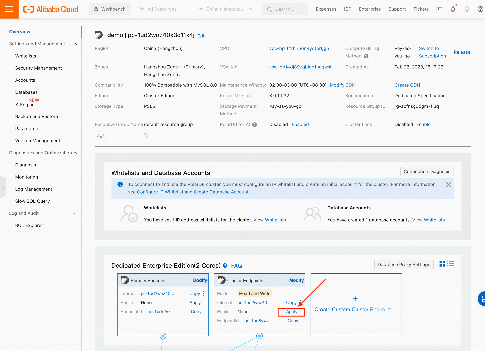
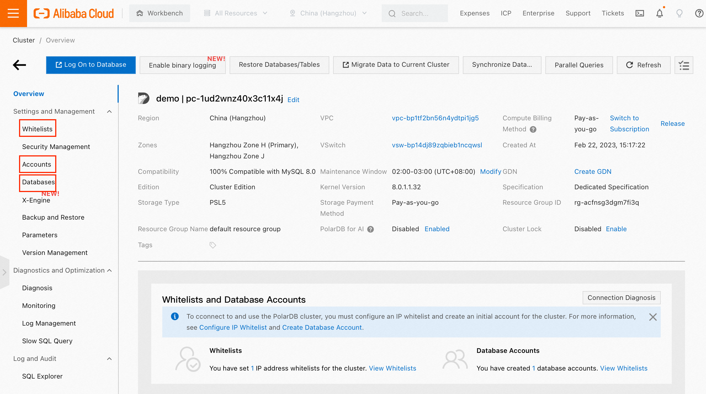
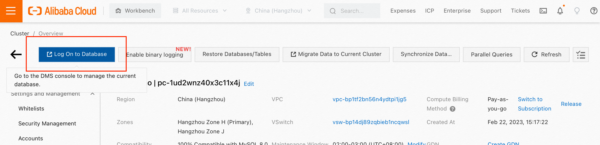
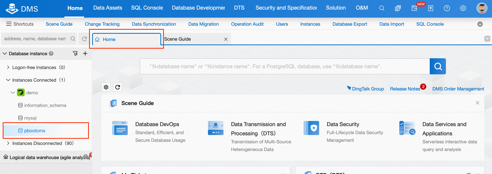

# Host a simple website with PolarDB as database backend
Quick start with website hosting on Alibaba Cloud with PolarDB MySQL as database backend, with advanced features like GDN.

## Prerequisites
1. PolarDB cluster as database backend
2. A web host

## Install LAMP environment
Install dependencies on the web host. This lab use Alibaba Cloud ECS instance with CentOS 7 system.
```shell
yum -y install httpd httpd-manual mod_ssl mod_perl mod_auth_mysql mysql epel-release git
yum -y install http://rpms.remirepo.net/enterprise/remi-release-7.rpm
yum -y install yum-utils
yum-config-manager --enable remi-php74
yum -y update
yum -y install php php-mysql gd php-gd gd-devel php-xml php-common php-mbstring php-ldap php-pear php-xmlrpc php-imap
```

## Configure PolarDB
1. Go to PolarDB console, select Clusters section
2. Go to the instance page by clicking on Cluster ID link
3. You will need a public cluster endpoint to access PolarDB.
In Cluster Endpoints block, click Apply to apply for a public endpoint.

4. Select Accounts on the left, and click Create Account to create a new account for website to use
5. Select Databases on the left, and click Create Database to create a database fot the website and authorize user to read and write.
6. In order to connect to Polar, whitelist incomming IP address.
Select Whitelists on the left, and add IP whitelist or modify the existing default whitelist to allow the web host to access the database

7. You and verify if PolarDB is running by logging in to the database with the public endpoint and user account just created.
```shell
mysql -h<endpoint> -P<port> -p<password> -u<user> -D<database>
```

## Host the Website
This lab uses open source project [PbootCMS](https://gitee.com/hnaoyun/PbootCMS)(in Chinese)
1. Clone the project and set up necessary files.
```shell
cd ~ && git clone https://gitee.com/hnaoyun/PbootCMS.git
cp -r PbootCMS/* /var/www/html/
chmod -R a+w /var/www/html
```
2. Import sample data for the website
```shell
mysql -h<endpoint> -P<port> -u<user> -p<password> -D<database> < $(ls /var/www/html/static/backup/sql/pbootcms*)
```
you can checkout imported data by connecting to the database from command line, or going to instance overview and click Log On to Database. From Home tab, select the database. You can see database is already populated with website data.


3. Configure website to connect to PolarDB.
Use this command to quickly setup the website, or manually edit `/var/www/html/config/database.php`
```shell
cat > /var/www/html/config/database.php << EOF
<?php
return array(
    'database' => array(
        'type' => 'mysqli',
        'host' => '<endpoint>',
        'user' => '<user name>',
        'passwd' => '<password>',
        'port' => '<endpoint port>',
        'dbname' => '<database name>'
    )
);
EOF
```
4. Make sure port 80 is open to public network on the web host, and restart httpd `systemctl restart httpd`
5. Now the website should be up and running, go to `http://<web host IP address>/` to checkout the sample website

## Enable GDN
Suppose you are hosting a service with global audience, your database will receive connection from around the world. In order to imporve latency, you can setup a GDN (Global Data Network) to serve a network of databases in multiple locations.
1. Go to PolarDB console
2. Select GDN from the left and click Create GDN. Select your exsiting database's region as primary region, and select the database as your primay cluster. Now you've created a GDN.
3. Click on the GDN ID, and you can see currently there is only one cluster in the GDN. You can add a secondary cluster by creating a new one. This may take a while.
4. Now you have a GDN. The primary cluster is in west US, and the secondaruy cluster is in east US. 
5. You can now configure the website to use the new secondary PolarDB cluster. On the secondary cluster, apply for a public endpoint, configure whitelist, and you should be able to connect the secondary cluster.

All data and modifications to the database is available on all clusters, so you can connect your web hosts to nearest PolarDB cluster, greatly reduce database access latency.

For a more detailed introduction and instruction on GDN, checkout [GDN hands on](../GDN/Polardb-M-GDN.md).

## Conclusion
This lab hosts a simple website using PolarDB for MySQL as database backend, demostrates basic usage of PolarDB, like basic management steps and how to connect to the database.
