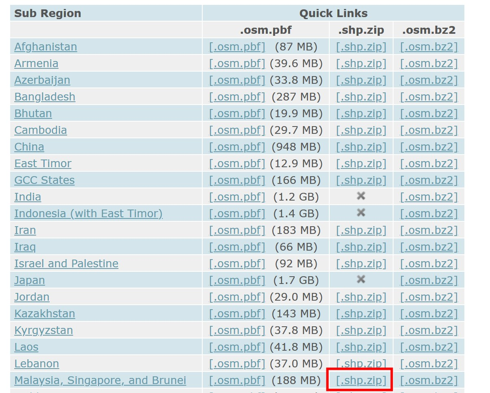
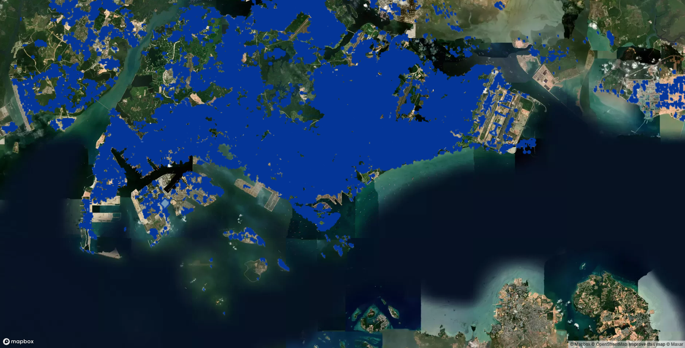
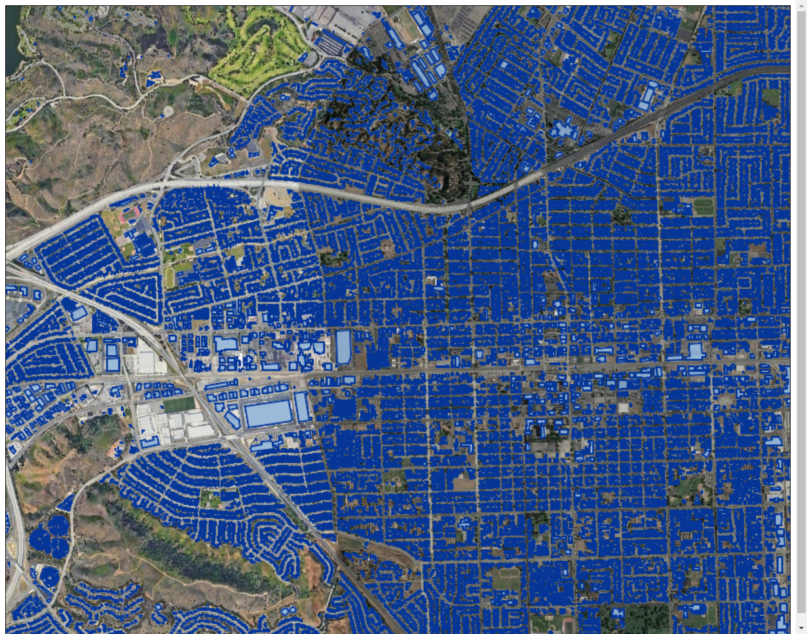
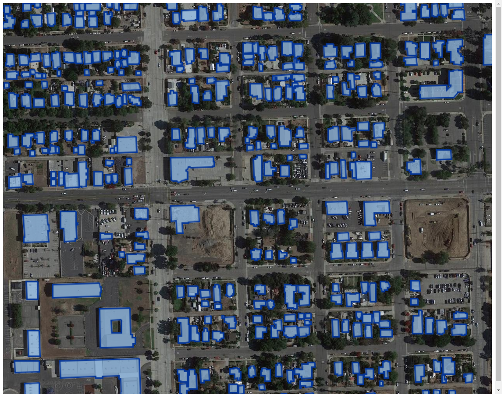

# Ganos Vector Pyramid on PolarDB PG

## 1. Introduction
This post introduces how to efficiently publish vector data for map services using Ganos.

In a GIS application scenario, the traditional approach of publishing vector data is to deploy a third-party map service, e.g., Geoserver,  in the server and connect it to the database. When a user accesses the vector data, the frontend interacts with the map service, and the map service interacts with the database. There are serveral limitations with this approach:

- It requires domain knowledge in GIS, which creates barrier for some users.
- It requires additional deployment and maintenance, which increases overall cost.
- The data are rapidly exchanged between the database and the service, which may be inefficient given a large data load.

In comparison, Ganos' vector pyramid addresses the above-mentioned limitations while realizing the same feature:

- The operation is pure SQL, so no domain knowledge in GIS is required. Addtionally, Ganos supports advanced parameter settings to support more complex user requirements.
- It uses the computational resources of the database and requires no addtional deployment.
- The data remains in the database throughout the process, so there's no cost for data transfers.

Compared to the traditional vector tiles,Ganos' vector pyramid is also advantageous:
- When the data size is large and the update frequency is low, as Ganos computes the vector pyramid through pre-processing, there's no cost of generating vector tiles dynamically.
- Vector pyramid supports partial update at different granularities, which makes data management more efficient.
- Vector pyramid also supports outputing vector tiles with parameters, with less overhead.

This post introduces Ganos' vector pyramid with a simple example. It introduces the entire process from data loading, pre-processing, coding the frontend and backend application, to data visualization.
> 

## 2. Download data
> Our test data comes from OpenStreetMap. Please see here for the [license](https://www.openstreetmap.org/copyright).

We use the vector data from the official website of [Geofabrik](https://download.geofabrik.de/). Specificially, we use the [build data](https://download.geofabrik.de/asia.html) in Malaysia, Singapore, and Brunei.
1. Download the data from website:



2. Unzip the files. In this example we store the files in the `malaysia-singapore-brunei-latest-free.shp` folder.
## 3. Loading building data

1. Install [GDAL](https://gdal.org/download.html#windows) on your system.(We use Windows as an example).
2. Execute the following command:
```shell
# import Malaysia, Singapore, and Brunei buildings data
ogr2ogr.exe PG:"host='YOUR_HOST' user='YOUR_USER' dbname='YOUR_DB_NAME' port='YOUR_PORT' password='YOUR_PASSWORD'" "D:/malaysia-singapore-brunei-latest-free.shp/gis_osm_buildings_a_free_1.shp" -progress
```
## 4. Build the vector pyramid

> We assume that the customer has purchased and opened a PolarDB PG instance.

1. Create Ganos Geometry Pyramid extension.
```SQL
CREATE EXTENSION ganos_geometry_pyramid CASCADE;
```

2. Build a vector pyramid.
```SQL
SELECT ST_BuildPyramid('gis_osm_buildings_a_free_1', 'wkb_geometry', 'ogc_fid','');
```

- In this example:
   - The loaded data table has the same name as the dataset,i.e., `gis_osm_buildings_a_free_1`.
   - The geometry field is `wkb_geometry`.
   - The unique id field is `ogc_fid`.
   - There's a total of 0.8 million records.
- The full detail of building the vector pyramid can be found in our [document](https://www.alibabacloud.com/help/en/apsaradb-for-rds/latest/functions-to-build-pyramids-st-buildpyramid).
- After successfully building the vector pyramid, it should have the same name as the data table,i.e., `gis_osm_buildings_a_free_1`.

## 5. Create the Demo
### 5.1 File Structure
The file structure is as follows:
```shell
.
├── app.py
└── pyramid_viewer.html
```
We have:

- app.py as the backend script.
- pyramid_viewer.html as the frontend script.
### 5.2 Backend Script
> We wrote the backend servies using Python+Flask+Psycopg2.

1. Install dependencies
```shell
# requires Python>=3.6
pip install flask psycopg2 psycopg2-binary
```

2. Modify the parameters in the backend script `app.py`:
```python
from psycopg2 import pool
from threading import Semaphore
from flask import Flask, Response, send_from_directory
import base64
import json

CONNECTION = "dbname=YOUR_DB_NAME user=YOUR_USER password=YOUR_PASSWORD host=YOUR_HOST port=YOUR_PORT"
PYRAMID_NAME = "gis_osm_buildings_a_free_1"


class ReallyThreadedConnectionPool(pool.ThreadedConnectionPool):
    def __init__(self, minconn, maxconn, *args, **kwargs):
        self._semaphore = Semaphore(maxconn)
        super().__init__(minconn, maxconn, *args, **kwargs)

    def getconn(self, *args, **kwargs):
        self._semaphore.acquire()
        return super().getconn(*args, **kwargs)

    def putconn(self, *args, **kwargs):
        super().putconn(*args, **kwargs)
        self._semaphore.release()


class TileFetcher:
    def __init__(self, connect):
        # use connection pool
        self.connect = ReallyThreadedConnectionPool(5, 10, connect)
        config = {
            "line_width": 2,
            "line_color": "#003399FF",
            "fill_color": "#6699CCCC",
            "background": "#FFFFFF00"
        }
        # set default render style for vector data
        self.default_style = json.dumps(config)
        self.default_transparent_png = base64.b64decode(
            'iVBORw0KGgoAAAANSUhEUgAAAAEAAAABCAYAAAAfFcSJAAAACXBIWXMAAA7EAAAOxAGVKw4bAAAADUlEQVQImWP4//8/AwAI/AL+hc2rNAAAAABJRU5ErkJggg==')

    def fetch(self, x, y, z):
        # render vector data on the database side
        sql = f"SELECT ST_ASPNG('{PYRAMID_NAME}','{z}_{x}_{y}','{self.default_style}')"
        pg_connection = self.connect.getconn()
        # return transparent png if no data is found
        result = self.default_transparent_png
        with pg_connection.cursor() as pg_cursor:
            pg_cursor.execute(sql)
            record = pg_cursor.fetchone()
            if record is not None:
                result = bytes(record[0])
        self.connect.putconn(pg_connection)
        return result


app = Flask(__name__)
tile_fetcher = TileFetcher(CONNECTION)


@app.route('/')
def pyramid_demo():
    return send_from_directory("./", "pyramid_viewer.html")


@app.route('/png/<int:z>/<int:x>/<int:y>')
def pyramid_png(z, x, y):
    png = tile_fetcher.fetch(x, y, z)
    return Response(png, mimetype="image/png")


if __name__ == "__main__":
    app.run(port=5000, host="0.0.0.0", threaded=True)
```

- Modify `CONNECTION` to use your own database.
- The detail of the `ST_ASPNG` fuction can be found in the [document](https://www.alibabacloud.com/help/en/apsaradb-for-rds/latest/functions-to-view-pyramids-st-aspng).
### 5.3 Frontend Script

1. Modify the frontend script `pyramid_viewer.html`:
```html
<!DOCTYPE html>
<html>
  
<head>
  <meta charset="utf-8">
  <title>Pyramid Viewer</title>
  <meta name="viewport" content="initial-scale=1,maximum-scale=1,user-scalable=no">
  <link href="https://api.mapbox.com/mapbox-gl-js/v2.12.0/mapbox-gl.css" rel="stylesheet">
  <script src="https://api.mapbox.com/mapbox-gl-js/v2.12.0/mapbox-gl.js"></script>
</head>

<body>
  <div id="map" style="position: absolute; top: 0; bottom: 0; width: 100%;"></div>
  <script>
    let CENTER = [103.851959, 1.290270]
    let YOUR_TOKEN = 'YOUR_TOKEN'

    mapboxgl.accessToken = YOUR_TOKEN;
    let map = new mapboxgl.Map({
      container: 'map',
      style: "mapbox://styles/mapbox/satellite-v9",
      center: CENTER,
      zoom: 11
    })
    map.on("load", () => {
      map.addSource('pyramid', {
        type: "raster",
        tiles: [`${window.location.href}png/{z}/{x}/{y}`],
        tileSize: 1024,
      });
      map.addLayer({
        id: 'buildings',
        type: 'raster',
        source: 'pyramid',
      });
    });
  </script>
</body>
</html>
```

- Set up `CENTER` to your point of interest,i.e.,`[103.851959, 1.290270]`.
- Set up `YOUR_TOKEN` to your mapbox token,see [here](https://docs.mapbox.com/help/glossary/access-token/) for more infomation.

## 6. Demo application

1. Run the script:
```shell
python ./app.py
```

2. Go to site:`localhost:5000`,and it will show the following pages by zooming and panning:





We can see the published building layer on the map.
